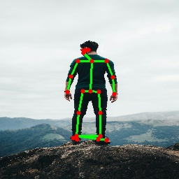

# Humanoid Locomotion Project

This project focuses on training a humanoid agent to walk using the Proximal Policy Optimization (PPO) algorithm within a MuJoCo simulation environment. The project is structured into modules for pose estimation, environment setup, and the learning agent.

This guide will walk you through getting the code, setting up the environment, extracting poses from images, training the model, and testing the results.

---

## 🏁 Getting Started 

### **Step 1 — Clone the Repository**

```bash
git clone https://github.com/niharika150107/final_isl.git
```

Once the clone is complete, navigate into the newly created project directory:

```bash
cd humanoid_project
```

---

## 📋 Prerequisites (Step 2)

Before you can run the project, ensure you have the following installed on your system:

-   **Python 3.8+**
-   **Git** (for cloning the repository). If you don't have it, download it from [git-scm.com](https://git-scm.com/).
-   **`pip`** (Python package installer, usually comes with Python).

---

## 🚀 Setup (Step 3)

Follow these steps inside your `humanoid_project` directory to prepare the development environment.

### **Step 3.1 — Create a Virtual Environment**

It's highly recommended to use a virtual environment to manage project dependencies and avoid conflicts.

```bash
python3 -m venv venv
```

### **Step 3.2 — Activate the Environment**

```bash
source venv/bin/activate
```
You should now see `(venv)` at the beginning of your terminal prompt.

### **Step 3.3 — Install Dependencies**

Ensure `req.txt` is in your project's root directory. Then, install all required packages.

```bash
pip install --upgrade pip
pip install -r req.txt
```
> **Note:** Installation may take some time as packages like `torch`, `mujoco`, and `mediapipe` are large.

---

## 📁 Project Structure

After cloning the repository and completing the setup, your project directory should look like this:

```
humanoid_project/
├── train.py                 # Script to train the PPO agent
├── test.py                  # Script to test the trained agent
├── module1.py               # Pose extraction from images
├── module2.py               # MuJoCo Humanoid Environment Wrapper
├── module3.py               # PPO Agent definition
├── req.txt                  # List of Python dependencies
├── pose_images/             # Folder for input pose images
│   ├── person1.png
│   └── ...
├── models/                  # Folder where trained models are saved
│   └── (created after training)
└── skeleton_drawn/          # Folder for pose visualization output
    └── (created by module1.py)
```

---

## 🎮 Usage Guide (Step 4)

### 1. Pose Extraction from Images (`module1.py`)

This script extracts a 19-joint pose vector from an image and creates a visualization with a skeleton overlay.

#### **Command**

```bash
python module1.py <path_to_image>
```

#### **Example**

```bash
python module1.py pose_images/person1.png
```

#### **What it does:**
-   Analyzes `pose_images/person1.png`.
-   Prints the 19-joint pose vector to the console.
-   Creates a `skeleton_drawn/` folder if it doesn't exist.
-   Saves a visualization with a green skeleton and red joints to `skeleton_drawn/person1_skeleton.jpg`.
### 🔹 Example: Pose Extraction Output

The following example shows how `module1.py` extracts a 19-joint pose vector and generates a skeleton overlay.

<p align="center">
  
  &nbsp;&nbsp;&nbsp;
  
</p>

<p align="center">
  <em>Left: Original image • Right: Skeleton visualization</em>
</p>

This visualization is automatically generated by:

```bash
python module1.py pose_images/person5.jpg
```

#### **Batch Processing (Optional)**
To process all images in the `pose_images` folder at once:

```bash
for image in pose_images/*.png; do
    python module1.py "$image"
done
```

---

### 2. Training the Agent (`train.py`)

This script starts the training process for the humanoid agent. It will save the trained model periodically in the `models/` directory.

#### **Command**

```bash
python train.py --epochs <number> --n-steps <number> --batch-size <number>
```

#### **Example**

```bash
python train.py --epochs 200 --n-steps 1024 --batch-size 64
```

#### **Arguments:**
-   `--epochs`: The total number of training cycles (e.g., `200`).
-   `--n-steps`: The number of environment steps per rollout (e.g., `1024`).
-   `--batch-size`: The minibatch size for the PPO optimizer (e.g., `64`).

---

### 3. Testing the Trained Model (`test.py`)

This script loads a trained model and runs a simulation to visualize the agent's performance in a GUI window.

#### **Command**

```bash
python test.py --model-path <path_to_model.pt> [--image-path <path_to_image>]
```

#### **Example**

```bash
# Test with a default initial pose
python test.py --model-path models/humanoid_ppo_epoch_200.pt

# Test with an initial pose from an image
python test.py --model-path models/humanoid_ppo_epoch_200.pt --image-path pose_images/person1.png
```

#### **Arguments:**
-   `--model-path` (Required): Path to the trained `.pt` model file generated by `train.py`.
-   `--image-path` (Optional): Path to an image to set the initial pose of the humanoid using `module1.py`.

#### **What to Expect:**
-   A GUI window will open, showing the 3D simulation.
-   The robot will be colored blue, and the floor will be white.
-   The simulation will run until the episode ends (e.g., the agent falls) or you close the window.
-   Close the simulation window to exit the script.

---

## 🛠️ Troubleshooting

### **Process killed during training**
WSL (Windows Subsystem for Linux) may run out of RAM. You can increase its memory allocation.

1.  Create or edit a `.wslconfig` file in your Windows user directory (`C:\Users\<YourUserName>\.wslconfig`).
2.  Add the following content, adjusting the values as needed:
    ```ini
    [wsl2]
    memory=12GB
    swap=16GB
    ```
3.  Save the file and restart WSL from an **Administrator** PowerShell or Command Prompt:
    ```bash
    wsl --shutdown
    ```

### **`ModuleNotFoundError: No module named '...'`**
This error usually means the virtual environment is not activated or the dependencies were not installed correctly.
1.  Ensure your terminal prompt shows `(venv)`.
2.  If not, activate it again: `source venv/bin/activate`.
3.  Re-install dependencies: `pip install -r req.txt`.

---

## 📌 Deactivating the Virtual Environment

When you are finished working on the project, you can deactivate the virtual environment:

```bash
deactivate
```

---

